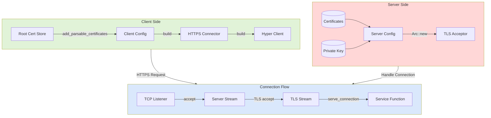
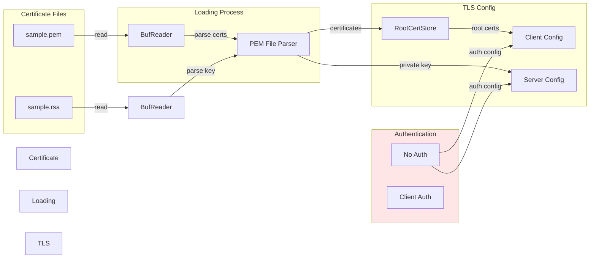

# TLS Integration with Rustls: Overview and Flow

This README provides a comprehensive overview of the TLS integration within our project, utilizing the Rustls ecosystem. It explains the client-server flow, certificate and key loading processes, and how the entire TLS configuration is structured for secure communication. We’ve included diagrams to visualize the architecture and enhance understanding.

---

## **1. Overview of Client-Server TLS Flow**

The communication between the client and server is mediated through a secure TLS connection established using Rustls. Both sides are configured independently but are compatible with each other. Below is the high-level architecture.

### **Client-Server Flow Diagram**


### **Explanation:**
1. **Client Side:**
   - **Root Certificate Store:** The client uses a root certificate store to validate the server's certificate.
   - **Client Configuration:** The client’s configuration is built with the root certificates and additional settings (e.g., HTTPS support).
   - **Hyper Client:** The client uses a Hyper client configured with `hyper_rustls` for making secure requests.

2. **Server Side:**
   - **Certificate and Key Loading:** The server loads its certificate and private key files.
   - **Server Configuration:** These files are wrapped in a `ServerConfig`, which defines the TLS settings for the server.
   - **TLS Acceptor:** A `TlsAcceptor` is built to handle incoming TLS connections.

3. **Connection Flow:**
   - A TCP listener waits for incoming connections.
   - The server stream is wrapped into a TLS stream upon successful negotiation.
   - The TLS stream is passed to a service function to handle HTTPS requests.

---

## **2. Certificate and Key Loading Process**

The certificate and key loading process is a critical step for both the server and client. The files are parsed and converted into formats suitable for Rustls configuration.

### **Certificate and Key Loading Diagram**


### **Explanation:**
1. **Certificate Files:**
   - The server and client rely on `.pem` files for certificates and `.rsa` files for private keys.

2. **Loading Process:**
   - The certificate and key files are read into memory using `BufReader`.
   - They are parsed using Rustls’s `pemfile` utilities, extracting certificates and private keys into manageable formats.

3. **TLS Config:**
   - Certificates are loaded into a `RootCertStore` for the client.
   - Private keys are used to configure the server's `ServerConfig`.

4. **Authentication:**
   - **No Auth:** The server and client configurations are set to not require client authentication.
   - This simplifies initial setup but can be enhanced later to include client certificate validation.

---

## **3. Implementation Details**

### **Key Functions:**
- **Client Configuration:**
  ```rust
  fn configure_client(root_cert_path: &str) -> ClientConfig {
      let mut root_cert_store = rustls::RootCertStore::empty();
      let certs = load_certs(root_cert_path).expect("Failed to load root certs");
      root_cert_store.add_parsable_certificates(&certs);
      
      ClientConfig::builder()
          .with_root_certificates(root_cert_store)
          .with_no_client_auth()
          .build()
  }
  ```

- **Server Configuration:**
  ```rust
  fn configure_server(cert_path: &str, key_path: &str) -> ServerConfig {
      let certs = load_certs(cert_path).expect("Failed to load certificates");
      let key = load_private_key(key_path).expect("Failed to load private key");
      
      ServerConfig::builder()
          .with_no_client_auth()
          .with_single_cert(certs, key)
          .expect("Invalid server configuration")
  }
  ```

---

## **4. Benefits of This Approach**
1. **Security:** 
   - Rustls provides modern cryptography and eliminates reliance on OpenSSL.
2. **Interoperability:**
   - Using standardized certificate formats ensures compatibility across environments.
3. **Scalability:**
   - Modular functions and clear configurations make it easy to adapt for additional features, such as client authentication or certificate revocation.

---