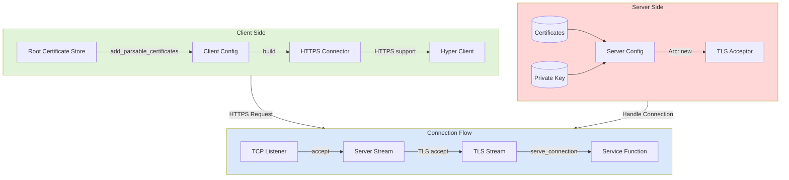

### Code Flow Explanation

Below is the flow of the code, broken into logical steps for both **Client** and **Server** operations, highlighting how they interact to establish a secure TLS connection.

---

#### **Flow Explanation:**
1. **Connection Setup:**
   - The client sends an HTTPS request to the server.
   - The server’s `TcpListener` accepts the connection and wraps it in a TLS stream.
   - The TLS handshake validates the server's certificate using the client’s root certificate store.

2. **Secure Communication:**
   - Once the TLS handshake succeeds, the server processes the request via the `echo` function.
   - The client receives a response from the server and validates its content.

#### **Server Side:**
- **Input:**
  - Certificate and private key files.
  - Incoming TCP connections.
- **Output:**
  - Secure TLS streams for communication.

#### **Client Side:**
- **Input:**
  - Root certificate files.
  - HTTPS URIs for the server.
- **Output:**
  - Verified server responses.

---

### **1. Server Flow**
The server initializes its configuration, listens for connections, and handles each connection securely using Rustls.

#### **Steps:**
1. **Load Certificates and Private Key:**
   - The server loads its `.pem` (certificate) and `.rsa` (private key) files using `load_certs` and `load_private_key`.

2. **Create ServerConfig:**
   - A `rustls::ServerConfig` object is built with the loaded certificate and private key.
   - It specifies whether client authentication is required (`with_no_client_auth` disables it).

3. **Wrap TCP Listener with TLS Acceptor:**
   - A `tokio_rustls::TlsAcceptor` wraps the `TcpListener`, enabling it to handle secure connections.

4. **Handle Connections:**
   - The server listens for incoming connections (`listener.accept()`).
   - Each accepted connection is wrapped in a TLS stream (`TlsAcceptor::accept`).
   - The TLS stream is passed to Hyper’s connection handler (`serve_connection`), which routes requests to the `echo` service function.

---

### **2. Client Flow**
The client initializes its configuration, establishes a secure connection to the server, and sends an HTTPS request.

#### **Steps:**
1. **Load Root Certificates:**
   - The client loads trusted root certificates using `load_certs`.
   - These certificates are added to a `rustls::RootCertStore` to verify the server’s certificate.

2. **Build ClientConfig:**
   - A `rustls::ClientConfig` is created with the root certificate store.
   - It specifies that no client-side authentication is required (`with_no_client_auth`).

3. **Create HTTPS Connector:**
   - The `hyper_rustls::HttpsConnector` is built using the client configuration.
   - It integrates HTTPS support into the Hyper client.

4. **Make HTTPS Request:**
   - The client sends a secure HTTP request to the server (`client.get(uri)`).
   - The server’s response is validated (e.g., checking the status code is `200`).

---

### **3. Interaction Flow**

#### **Diagram:**

---
